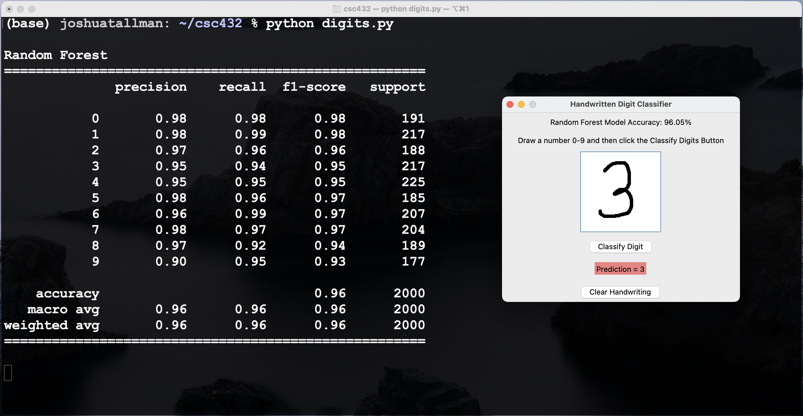

# Handwritten Digit Recognizer ##

Create a simple handwritten digit recognition program that can read the numbers 0–9. Your program will allow the user to draw a single digit in a graphical window and then use a machine learning classification model to predict which digit was written.

You will use the MNIST database of labeled handwritten digits as the training data for your model. You may use K-Nearest Neighbors, Random Forest, Logistic Regression, or another reasonable classification algorithm.

This is a simplified form of Optical Character Recognition (OCR). Real OCR systems need to locate and separate characters, recognize letters and punctuation, deal with different fonts and handwriting styles, and often interpret entire words or documents. We are going to begin with the much more manageable problem of recognizing one isolated digit.

## Assignment ##

Create a Python program with a graphical drawing area that accepts mouse or trackpad input. The user should be able to:

1. draw a single digit from 0–9;
2. click a button to have the program analyze the drawing; and
3. see the digit predicted by your machine learning model.

The drawing area should be large enough that it is comfortable for the user to write a digit. However, the MNIST dataset contains images that are only 28 × 28 pixels, so your program will need to convert the user's drawing into a form that is reasonably similar to the MNIST training data before giving it to the classifier.

You may use any Python GUI library. I have provided example code using Tkinter, which is part of Python's standard library and underlies some of the graphical programming that you have already seen with Turtle. Other GUI libraries such as PyQt and PyGUI are also acceptable.

Your machine learning model should be trained using MNIST data and should use an appropriate classification algorithm. Some algorithms will work better than others, and you are encouraged to experiment.

## The Real Challenge ##

Training a classifier on MNIST is relatively straightforward. Getting that classifier to recognize *your own handwriting* may be considerably harder. For example, a Random Forest model might achieve approximately 96% accuracy when tested on held-out MNIST images. That sounds excellent, but both the training and testing images come from the same dataset and have been prepared in similar ways. A digit drawn with your mouse or trackpad may look quite different.

Your program therefore needs to think about how the input image is prepared before classification. Depending on your implementation, this might include:

- resizing the image to 28 × 28 pixels;
- converting it to grayscale;
- making sure the background and digit have the correct light/dark orientation;
- scaling or normalizing pixel values;
- centering the digit;
- preserving the digit's proportions when resizing; and
- adjusting line thickness or other characteristics of the drawing.

You do not have to implement all of these techniques. Part of the project is determining which preprocessing steps actually help your classifier recognize handwritten digits.

## Hints ##

1. Begin by getting a classifier working directly with MNIST before adding the graphical interface. Make sure you know that the machine learning portion works before debugging the GUI at the same time.

2. Test your model using a proper training/test split or the standard MNIST training and testing sets. This gives you a baseline for how well the classifier performs on MNIST itself.

3. Once the GUI works, test several different digits written in different ways. A model that recognizes your carefully drawn `1` may still struggle with someone else's `1`.

4. If your model performs well on MNIST but poorly on digits drawn in your program, the classifier may not be the problem. Compare the image produced by your GUI with actual MNIST images. The preprocessing step may be more important than changing algorithms.

5. Some digits will probably be easier to recognize than others. Look at which digits your model commonly confuses and think about why.

6. You do not need the most sophisticated machine learning algorithm available. A relatively simple classifier combined with good preprocessing may work surprisingly well.

## Files ##

The following demonstration files illustrate several pieces that may be useful for the project. They are examples rather than a complete solution.

- MNIST Demo: [mnist_demo.py](https://github.com/prof-tallman/csc432student/blob/main/classification/src/mnist_demo.py)
- Pillow Demo: [pillow_demo.py](https://github.com/prof-tallman/csc432student/blob/main/classification/src/pillow_demo.py)
- Scikit-image Demo: [skimage_demo.py](https://github.com/prof-tallman/csc432student/blob/main/classification/src/skimage_demo.py)
- Tkinter Demo: [tkinter_demo.py](https://github.com/prof-tallman/csc432student/blob/main/classification/src/tkinter_demo.py)
- Demonstration Image: [dept_photo.jpeg](https://github.com/prof-tallman/csc432student/blob/main/classification/src/dept_photo.jpeg)

## References ##

These resources helped me create this assignment. They might help you understand MNIST, handwritten digit classification, and possible approaches to the project.

- [Understanding how Machine Learning can Classify Handwritten Digits](https://medium.com/analytics-vidhya/understanding-how-machine-learning-can-classify-handwritten-digits-e2b7838b8357) by GreekDataGuy
- [Hand Digit Recognition using Logistic Regression](https://medium.com/analytics-vidhya/hand-digit-recognition-using-logistic-regression-python-sklearn-364d02ad02db) by Wakeupcoders
- [Handwritten Digit Recognition using Machine Learning in Python](https://arnab-dey.medium.com/handwritten-digit-recognition-using-machine-learning-in-python-a22d562a1e1f) by Arnab Dey
- [MNIST on Wikipedia](https://en.wikipedia.org/wiki/MNIST_database)

## Grading — 50 Points ##

Your grade is based primarily on whether your program successfully applies a machine learning classifier to handwritten digits and on the quality of your image preprocessing. I do not expect perfect recognition. In fact, part of the point of the project is discovering why a classifier that performs very well on MNIST may perform much worse on handwriting collected through your own interface.

* **~25–30 points:** You have made substantial progress on the project, but major pieces are incomplete or do not yet work together. For example, you may have a working MNIST classifier or a working drawing interface, but not a complete program that can classify a digit drawn by the user.

* **~30–40 points:** Your program allows the user to draw a digit and produces a prediction using a model trained on MNIST. The basic pipeline works, although preprocessing may be fairly simple and recognition of user-drawn digits may be inconsistent.

* **40–45 points:** Your program works reliably, uses an appropriate classification model, and includes thoughtful preprocessing to make user-drawn digits more similar to MNIST data. You have tested the program with multiple digits and made reasonable adjustments based on the results.

* **45–50 points:** Your project is particularly well designed and polished. The classifier and GUI work smoothly together, preprocessing is carefully considered and implemented, and you have experimented with or evaluated different approaches in order to improve recognition. Your program demonstrates a strong understanding of why preprocessing matters when applying a model to data that differs from its original training set.

A model with slightly lower accuracy may earn more points than one with higher accuracy if the first project demonstrates better reasoning, experimentation, and understanding. The goal is not simply to make the computer guess correctly as often as possible, but to understand what makes the machine learning system work.

## Groups ##

Feel free to collaborate with your friends on this project, but each person should create his or her own project. There should be something distinctive about your implementation. That difference could involve the GUI, classification algorithm, image preprocessing, normalization, evaluation, or another meaningful design decision. You are welcome to share ideas and help each other solve technical problems, but make sure that you understand the code in your own project.

## Potential Future Work ##

This project deliberately recognizes only one digit at a time. There are many ways that it could be extended:

- **Personalized handwriting:** Allow the user to provide examples of his or her own handwriting and retrain or fine-tune the model using those examples *(medium difficulty)*.
- **Letters and punctuation:** Add letters, punctuation, or other symbols using an appropriate online dataset *(medium difficulty)*.
- **Multiple characters:** Allow the user to write a complete number, word, or line of text *(hard).* One of the biggest challenges will be determining where one character ends and the next begins.
- **Words and language:** Go beyond recognizing individual characters by using information about likely words. A spell checker or simple language model could sometimes correct character-recognition mistakes *(hard).*

At that point you would be moving from a simple handwritten digit classifier toward a more complete OCR system.
