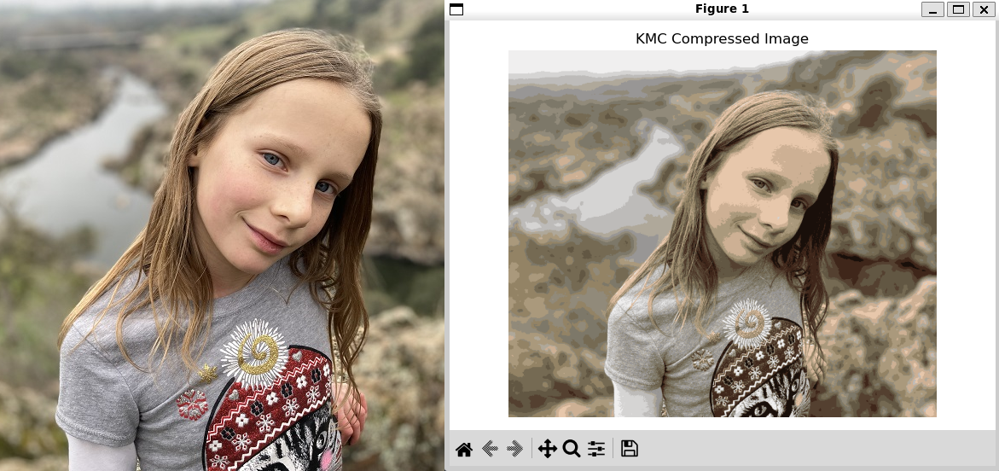

# K-Means Image Compression #

Clustering can be used as a simple form of image compression.

A traditional 24-bit bitmap image uses three bytes for every pixel: one byte each for the red, green, and blue color channels. A photograph may therefore contain thousands or even millions of distinct RGB colors.

For this project, you will use K-means clustering to reduce an image to a palette of only 16 representative colors. Each cluster centroid becomes one color in the new palette, and every original pixel is replaced by the index of the nearest palette color. Since 16 possible values can be represented with only four bits, each compressed pixel can be stored using four bits instead of the original 24. That means the pixel data can theoretically shrink from 24 bits per pixel → 4 bits per pixel, or approximately 1/6 of its original size (plus a small amount of overhead for the file header and color palette).

The machine learning portion of this project is fairly straightforward. Much of the challenge will come from understanding how images are represented and from reading and writing a custom binary file format.



## Assignment ##

Complete the `kmcimage.py` program so that it can:

1. read an ordinary uncompressed BMP image and save it as a compressed KMC image; and
2. read a KMC image from disk and reconstruct and display the image.

You may use the provided skeleton program or start from scratch.

When saving an image, your program should:

- read a BMP file;
- use K-means clustering to reduce the image to 16 representative colors;
- use those colors as the KMC palette;
- replace every pixel with the index of its closest palette color;
- pack the palette indexes into four-bit values;
- save the result using the KMC file format; and
- display the original and compressed images side-by-side.

When loading an image, your program should:

- read a KMC file;
- read its dimensions and color palette;
- unpack the compressed pixel values;
- reconstruct the RGB image using the palette; and
- display the resulting image.

You are welcome to use the Scikit-Learn implementation of K-means. You do not need to implement the K-means algorithm yourself.

## Why BMP? ##

Use an uncompressed image format such as BMP for the original image. Formats such as JPEG and HEIC already use sophisticated compression algorithms. K-means would still reduce the number of colors in those images, but comparing the resulting file sizes would not tell us very much because the original file is already compressed. A traditional 24-bit BMP gives us a much clearer comparison between the original pixel representation and our KMC representation.

## KMC File Format ##

A KMC file contains three sections:

1. an 8-byte header;
2. a 48-byte color palette; and
3. the compressed pixel data.

### Header ###

Every KMC file begins with the following 8-byte header:

| Bytes | Meaning             |
| ----- | ------------------- |
| 0–3   | Magic string `KMC:` |
| 4–5   | Image width         |
| 6–7   | Image height        |

The width and height are unsigned two-byte integers stored in big-endian byte order. Because each dimension is stored using two bytes, the maximum width or height that can be represented is 65,535 pixels.

### Color Palette ###

Immediately after the header comes a palette containing exactly 16 colors. The palette colors should come from the centroids generated by K-means. Each color is stored using the traditional three bytes RGB values: The complete palette therefore occupies:

```
16 colors × 3 bytes = 48 bytes
```

Each pixel in the compressed image stores the index of one of these colors rather than storing its RGB values directly. Palette indexes therefore range from 0 through 15.

### Pixels ###

The compressed pixel data comes immediately after the palette. Since there are only 16 possible palette indexes, each pixel can be represented using four bits. Two pixels are therefore packed into each byte. The first pixel is stored in the high-order four bits, and the second pixel is stored in the low-order four bits. For example, suppose two consecutive pixels refer to palette entries 3 and 12:

```
3  = 0011
12 = 1100
```

They are stored together as:

```
0011 1100
```

Pixels should be stored in normal image order: left-to-right across each row and then top-to-bottom through the image. If the image contains an odd number of pixels, store the final pixel in the high-order four bits of the final byte and set the unused low-order four bits to zero.

## Preparing the Image for K-Means ##

When you load a color image into Python, it will normally be represented as a three-dimensional array: `height × width × 3`. The last array dimension contains the red, green, and blue values.

K-means expects a collection of samples and features. For this project, each pixel is a sample and each sample has three features: red, green, and blue. You will therefore need to reshape the image into something resembling:

```
number_of_pixels × 3
```

After clustering, each pixel will have a cluster assignment. That assignment becomes the palette index stored in the compressed image.

To display the compressed image, you will need to convert those palette indexes back into RGB values and reshape the image back into its original dimensions.

## Hints ##

1. The file format is probably harder than the machine learning. Running K-means requires relatively little code. Reading and writing the binary representation correctly will probably take more thought.

2. Work on the project in stages. First make sure that you can load and display a BMP image. Then reduce it to 16 colors. Then reconstruct and display the reduced-color image. Only after that should you begin writing the KMC file.

3. Python byte strings are useful when reading and writing binary files.

4. Make sure you understand the difference between a palette color and a palette index. The compressed pixel data contains indexes, not RGB values.

5. Inspect the shape of your NumPy arrays frequently while developing the project. Many image-processing bugs come from assuming that an array has a different shape than it actually does.

6. K-means centroids may contain floating-point values even though RGB color channels must ultimately be whole numbers from 0–255.

7. Be careful about NumPy data types when performing bitwise operations.

8. Test your writer and reader together. Save an image as KMC, reload it, and make sure that the reconstructed image matches the compressed version you expected.

9. Also test your reader using the instructor-provided KMC file. If your program can only read files that it created itself, you may have implemented the format incorrectly in both places.

10. You can calculate approximately how large a KMC file should be:

```
8-byte header
+ 48-byte palette
+ approximately 1/2 byte per pixel
```

If the actual file size is dramatically different, investigate why.

11. The resulting KMC image does not need to look identical to the original. Reducing an image to 16 colors necessarily throws away information. The goal is to preserve a recognizable image while greatly reducing the amount of data used to represent each pixel.

## Files ##

* [image_compression.pptx](https://github.com/prof-tallman/csc432student/blob/main/clustering/doc/image_compression.pptx)
* [image_compression.ipynb](https://github.com/prof-tallman/csc432student/blob/main/clustering/src/image_compression.ipynb) — demonstrates K-means image compression using 256 colors
* [kmcimage.py](https://github.com/prof-tallman/csc432student/blob/main/clustering/src/kmcimage.py) — skeleton program
* [hershey.bmp](https://github.com/prof-tallman/csc432student/blob/main/clustering/src/hershey.bmp) — sample uncompressed image
* [hershey.bmp.kmc](https://github.com/prof-tallman/csc432student/blob/main/clustering/src/hershey.bmp.kmc) — sample KMC image

## References ##

* [K-means Clustering: Algorithm, Applications, Evaluation Methods, and Drawbacks](https://towardsdatascience.com/k-means-clustering-algorithm-applications-evaluation-methods-and-drawbacks-aa03e644b48a)

## Generative AI ##

Generative AI use is very limited for this project. You may use AI to:

- explain Python syntax or an unfamiliar library function;
- explain a specific error message;
- help diagnose a bug after you have already attempted to solve it yourself;
- explain concepts such as byte order, bitwise operators, NumPy array shapes, or RGB color representation; and
- explain how to call Scikit-Learn's K-means implementation.

You may not use AI to generate the code that implements the KMC file format or the core image-processing pipeline. In particular, do not ask AI to write code that:

- creates or parses the KMC header;
- reads or writes the image dimensions;
- reads or writes the color palette;
- packs two four-bit pixels into one byte;
- unpacks four-bit pixels;
- converts palette indexes back into RGB pixels;
- reshapes the image data for this assignment; or
- combines these steps into a working compressor or decompressor.

You may ask AI to explain an individual concept and then implement it yourself. For example, this is reasonable:

> How do the left-shift and bitwise OR operators work in Python?

But this is not:

> Write a function that packs my KMC palette indexes two per byte.

The restrictions are intentional. Scikit-Learn performs most of the actual clustering for you. The main programming challenge is understanding how the image data is represented and correctly translating between that representation and a binary file.

You are responsible for understanding every part of the program that you submit.

Please add references and attribution where appropriate.

## Grading — 50 Points ##

Your grade is based primarily on whether your program correctly uses K-means to reduce an image to 16 colors and whether it correctly implements the KMC binary file format.

The visual quality of the compressed image matters somewhat, but this is not a contest to produce the prettiest image. Correct representation, compression, and reconstruction are more important.

- **~25–30 points:** You have made substantial progress, but major pieces are incomplete. For example, you may successfully reduce an image to 16 colors or partially read/write the KMC format, but the complete compression and decompression process does not yet work.
- **~30–40 points:** Your program successfully uses K-means to create a reduced-color image and implements most of the KMC format. It can save or load useful KMC data, although there may still be problems with bit packing, file compatibility, reconstruction, or edge cases.
- **40–45 points:** Your program correctly reads BMP images, uses K-means to generate a 16-color palette, writes valid KMC files, reads KMC files, reconstructs the image correctly, and packs two four-bit palette indexes into each byte. Your files are compatible with the instructor-provided KMC format rather than merely with your own reader and writer.
- **45–50 points:** Your compressor and decompressor are complete, reliable, and carefully implemented. The binary file format is handled correctly, the palette and image dimensions are processed cleanly, the four-bit pixels are packed efficiently, and the program provides useful display or debugging behavior. The code is organized, readable, and demonstrates a strong understanding of both clustering and binary data representation.

A particularly strong project should make it clear that you understand why the K-means centroids become the color palette, what the cluster assignments represent, and how storing those assignments instead of full RGB values reduces the size of the image data.

## Groups ##

Feel free to collaborate with your friends on general concepts and debugging ideas, but each student should write his or her own implementation.

Because everyone is implementing the same precisely defined file format, the programs will naturally perform many of the same steps. However, the code that performs the image conversion, binary file processing, and bit manipulation should be your own.
