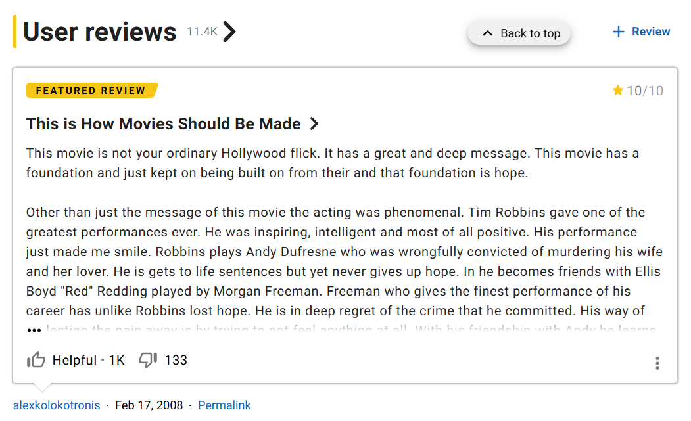

# Movie Review Sentiment Analysis #

Create a neural network model that reads a movie review and classifies it as either positive or negative. Your model will train on the Stanford AI Lab's IMDb movie review dataset. Your final program should allow the user to type a new movie review and then perform sentiment analysis on the text.

This project is partly about neural networks, but much of the interesting work happens before the data ever reaches the neural network. Computers cannot directly process sentences like:

> This movie was surprisingly good.

You will need to decide how to convert raw text into a consistent collection of numerical features that a neural network can use.

## Assignment ##

Create a neural network that classifies movie reviews as either positive or negative. Your model must train using the raw IMDb movie review dataset provided by the Stanford AI Laboratory. The dataset contains a large collection of individual text files organized into several directories. Read the included README file so that you understand how the data is organized.

You will primarily use the positive and negative reviews from the training and testing datasets. You may partition the available reviews into training, validation, and testing data however you believe is appropriate. However, your final program must allow a user to type a new movie review and receive a prediction of either:

- Positive
- Negative

You may also display the model's confidence or probability if you would like.

## Processing the Text ##

A major portion of this project is converting raw movie reviews into numerical features that can be used by your neural network. For this project, you must write the basic tokenization and text-processing code yourself. You may use normal Python tools such as:

- strings;
- lists;
- dictionaries;
- sets;
- regular expressions; and
- basic NumPy or Pandas operations.

However, you may **not** use a library function that performs the tokenization for you. The purpose of this restriction is to make sure that you understand how text is transformed into machine-learning features rather than treating the preprocessing pipeline as a black box. For example, do not use:

- Keras `Tokenizer`;
- NLTK `word_tokenize`;
- NLTK `FreqDist`; or
- another library that performs the core tokenization or vocabulary-building process for you.

Once you have created your tokens and numerical features, you may use machine learning libraries for ordinary tasks such as:

- splitting data;
- converting data to tensors;
- batching data;
- normalization or standardization;
- training the neural network; and
- evaluating the model.

Your preprocessing must be applied consistently. A word should not be represented one way while training the model and another way when the user enters a new review.

## Creating the Features ##

There are many sophisticated ways to represent language, but we are deliberately keeping this project relatively simple. Reasonable approaches include:

- **Binary Bag-of-Words:** Record whether each selected word appears in the review.
- **Count-Based Term Frequency:** Record how many times each selected word appears.
- **Term Frequency-Inverse Document Frequency (TF-IDF):** Give greater weight to words that are common within a particular review but less common across reviews in general.

You are not expected to create a recurrent neural network, transformer, embedding-based language model, or ChatGPT-style system. Those approaches model language in considerably more sophisticated ways and are beyond the scope of this project.

If you want to use a substantially different text representation, check with Prof. Tallman.

## Neural Network ##

Your final classifier must use a neural network implemented with a machine learning framework such as:

- PyTorch;
- Keras; or
- TensorFlow.

The architecture does not need to be complicated. In fact, a relatively small neural network may work very well if your text-processing strategy produces useful features.

You should evaluate your model using data that was not used to train it.

## Program Organization ##

You do not need to put everything into a single Python program. For example, you might create:

1. one program that reads and processes the raw IMDb files;
2. another program that trains and saves the neural network; and
3. another program that loads the saved model and classifies reviews entered by the user.

The choice is yours, but all code used to create the project must be included in your submission, and the purpose of each file should be clear.

## Hints ##

1. **Begin with the raw data.** Do not use a cleaned CSV version of the IMDb dataset from Kaggle or another source. Part of this project is learning how to work with a real collection of raw text files.

2. **Inspect the reviews before writing your parser.** Real text contains punctuation, capitalization, numbers, HTML tags, contractions, and other surprises. Decide which of these things matter for your model.

3. **Be consistent.** If you lowercase words, remove punctuation, ignore HTML tags, or perform another preprocessing operation while training, the same transformation should occur when the user enters a new review.

4. **Think carefully about vocabulary size.** Including every word that appears in the dataset can create an enormous input layer. You may want to ignore very rare words or limit your vocabulary to the most useful terms.

5. **Do not assume that more features are always better.** Common words such as `the`, `and`, and `movie` may occur frequently without providing much information about whether a review is positive or negative.

6. **Make sure your evaluation data remains separate from your training data.** Otherwise you may obtain very impressive accuracy numbers that do not reflect how well the model handles new reviews.

7. **Watch both training and validation performance.** If training accuracy continues increasing while validation performance stops improving or becomes worse, your model may be overfitting.

8. You may use an epoch limit, but your training process should ideally detect when further training is no longer producing meaningful improvement rather than blindly running every possible epoch.

9. If your framework can use a GPU and one is available, you are welcome to take advantage of it. However, this model should also be reasonable to train on ordinary hardware.

10. Think about execution time while designing the project. A slightly simpler representation that trains quickly may be more useful than an enormous feature set that produces only a tiny increase in accuracy.

11. Test your finished program with reviews that are not part of the Stanford dataset. Try obvious reviews, ambiguous reviews, short reviews, and perhaps a few deliberately strange ones. See where your model succeeds and where it fails.

## Files ##

* [Raw IMDb Dataset from Stanford AI Lab](https://ai.stanford.edu/~amaas/data/sentiment/aclImdb_v1.tar.gz)

## References ##

* [Stanford AI Lab's Sentiment Analysis Large Movie Review (IMDb) Dataset](https://ai.stanford.edu/~amaas/data/sentiment/)

## Generative AI ##

Generative AI may be used as a learning and programming assistant for this project, but it should not perform the central text-processing work for you. You may use AI to:

- explain unfamiliar Python or neural-network code;
- help debug errors;
- explain concepts such as bag-of-words, TF-IDF, overfitting, or early stopping;
- help with ordinary file handling or user-interface code;
- explain how PyTorch, Keras, or TensorFlow functions work; and
- help you think through possible experiments or ways to evaluate your model.

However, AI may not generate the tokenization code or text-processing pipeline for you. The process of reading raw reviews, deciding how text should be cleaned, breaking the reviews into tokens, constructing a vocabulary, and converting those tokens into features is one of the main learning objectives of the project.

You may use AI to research an individual technique and then implement it yourself. For example, you could ask AI why removing very rare words might help a bag-of-words model, make sure that you understand the explanation, and then write your own code to perform that operation.

Similarly, you should make the important modeling decisions yourself. AI may explain different neural network architectures or training techniques, but it should not simply generate an entire finished solution that you submit without understanding.

You are responsible for understanding all code that appears in your project, testing it carefully, and checking AI-generated suggestions for errors.

Please add references and attribution where appropriate.

## Grading — 50 Points ##

Your grade is based primarily on whether you successfully construct a sentiment-analysis system from the raw IMDb reviews and demonstrate an understanding of how the text is converted into features for a neural network.

Accuracy matters, but accuracy alone does not determine the grade. A model that achieves slightly lower accuracy through a well-designed and clearly understood process may be stronger than a highly accurate model built from inappropriate shortcuts or data leakage.

* **~25–30 points:** You have made substantial progress, but important pieces of the project are incomplete or do not yet work together. For example, you may successfully parse the IMDb files or train a neural network, but not yet have a complete pipeline that accepts and classifies a new review.

* **~30–40 points:** Your program reads the raw Stanford IMDb data, manually tokenizes the reviews, converts them into numerical features, trains a neural network, and produces positive/negative predictions. The basic system works, although the preprocessing, model, evaluation, or handling of new reviews may still be fairly simple.

* **40–45 points:** Your project has a sound and consistent preprocessing pipeline, uses a reasonable feature representation, trains and evaluates an appropriate neural network, and produces reasonably accurate predictions on unseen data. The program handles ordinary variations in user input and demonstrates attention to issues such as vocabulary selection, overfitting, and consistent feature generation.

* **45–50 points:** Your project is particularly well designed and carefully evaluated. Raw data processing and tokenization are handled thoughtfully, feature construction is well justified, the neural network is trained efficiently, and evaluation demonstrates that you understand how well the model generalizes. The finished program handles real user-entered reviews reliably and the code is organized, readable, and well documented.

A particularly high-scoring project does not need to use a complicated neural network. Good preprocessing, careful evaluation, and a clear understanding of the entire pipeline are more important than simply adding layers or making the model larger.

## Groups ##

Feel free to collaborate with your friends on this project, but each person should create his or her own project. You are welcome to share ideas and help each other solve technical problems, but make sure that you understand the code and design choices in your own project. You are allowed to look at each other's code as part of any discussions, but you are prohibited from copying code from one computer to another.

There should be something distinctive about your implementation. That difference could involve your text preprocessing, vocabulary selection, feature representation, neural network architecture, user interface, evaluation strategy, or another meaningful design decision.
